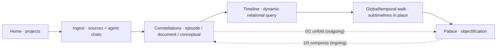

# Refinement 2 — Places, Stories, Palace: grilled design

**Date:** 2026-08-09
**Status:** design pass for `2026-08-09-refinement-2-direction.md`. This file locks the
decisions the direction brief opened (D1–D6), grounded in codebase inspection and external
research. The GitHub wayfinder map created from this file carries one ticket per section;
ticket bodies are self-contained and reference this doc for the canonical contracts.

## 0. What changed relative to the previous pass

The previous build (map #12, slices #13–#16) shipped: Temporal Place + Scene contracts,
nestable timelines, an offline gazetteer/tile pack, a map surface with walks, a street-view
store with local redaction, a migration-profile story with consent/keepsake export, and a
"mind palace" of cluster cards. Verified against the codebase:

- `PalaceLens` renders chambers as an ordered list of cards (`<ol>`/`<li>` with member chips)
  — a clustering re-skin, not a spatial place. It must be replaced.
- The "globe" today is a flat GeoJSON point basemap on a MapLibre map; `maplibre-gl@6.2.0`
  (already the pinned dependency) supports the globe projection, so the globe is a rendering
  decision inside one engine, not a stack swap.
- Street view has a store + redaction pipeline but no way to fetch imagery; the terminal
  bridge (xterm ↔ PTY) exists and is the seam the agentic fetch spec uses.
- The story surface is migration-framed in visible language and in the seed narrative.
- The shell presents five tab lenses; the product is a pipeline, and the UI must say so.

## 1. Research sources (palace foundation and friends)

The palace ticket's foundation decisions draw on:

- **Rayan (dev.to, yelnady)** — a real 3D memory palace in Three.js: first-person navigation,
  rooms/walls/objects, artifacts placed on walls, room synthesis, semantic recall grounded in
  the stored artifacts. Relevant ideas: spatial encoding as a retrieval mechanism, objects
  placed in rooms as first-class memory units, per-room navigation, live placement of new
  artifacts. Not reusable directly (Gemini Live + Firebase + cloud stack, not local-first),
  but its spatial model validates the direction. Source:
  https://dev.to/yelnady/i-built-a-3d-memory-palace-that-listens-remembers-and-speaks-back-2hip
- **Obsidian "Memory Palace 3D"** — Three.js `CSS3DRenderer` rooms as cubes with six named
  wall faces (`front/back/up/down/left/right`) + a floating central object; images attach to
  wall faces; FPS navigation. Precedent for **wall fixtures** and room-as-chamber — **not an
  integration target** (it is an Obsidian plugin; we take its principles, never its code).
  The six-face pattern is re-derived as the bootstrapping profile's QL 6+6' tacit structural
  layer (§D5 item 11). Source: https://github.com/latazadehomero/memory-palace
- **Palais de Mémoire** — build rooms, place memory objects inside them, pick objects up and
  carry them between rooms. Precedent for **object placement and object inventory**.
  Source: https://github.com/christopherdebeer/Palais-de-Memoire
- **React Three Fiber v9 ↔ React 19** — the repo is on React 19; `@react-three/fiber@9`
  pairs with React 19, v8 with React 18. R3F is the declarative integration for a React app;
  the scene graph itself is plain three.js objects, so scene-building logic stays testable
  outside React. Source: https://r3f.docs.pmnd.rs/getting-started/installation
- **three-mesh-ui** — 3D UI panels built as normal three.js meshes (an HTML/CSS-like block
  model); candidate for text/title fixtures, but not required — CanvasTexture panels are
  lighter and fully testable. Source: https://github.com/felixmariotto/three-mesh-ui
- **WebGL2 in Tauri (macOS WKWebView)** — WebGL2 is available on macOS 13+ (Safari 16+);
  older macOS is the known risk. The app targets current macOS; an explicit engine
  capability probe is part of the palace evidence gate. Sources:
  https://github.com/tauri-apps/tauri/issues/2866 and terraviz DESKTOP_APP_PLAN (WebGL2 on
  macOS 13+ WKWebView).
- **MapLibre globe + offline PMTiles** — MapLibre GL JS globe projection (v4+, pinned 6.2.0)
  renders GeoJSON sources fully offline; vector/raster tiles can be packaged as PMTiles and
  served locally (pmtiles protocol / local file access). The existing pack builder emits a
  GeoJSON basemap — sufficient for a terrain-less globe with places and route lines.
  Sources: https://maplibre.org/maplibre-gl-js/docs/examples/globe/ and the pmtiles project.
- **3D graph as in-room object** — three-forcegraph / 3d-force-graph render nodes/edges as
  three.js objects; the pattern is directly reusable as a **constellation object** (a
  chamber's subgraph unfolding as a 3D mind map inside the room), instead of adopting a
  third-party force layout wholesale where a deterministic seeded layout over the chamber
  subgraph is simpler to test. Source: https://github.com/vasturiano/three-forcegraph

## 2. Locked decisions

### D1 — Places is globe-first (MapLibre globe, offline-validated)

- The Places surface renders a **3D globe** by default using MapLibre GL JS globe projection
  (`projection: "globe"`, already pinned `maplibre-gl@6.2.0`). No CesiumJS, no second engine,
  unless a documented evidence gate fails (terrain/3D-tiles need outgrowing the globe).
- Offline posture is validated first: the globe must render from the bundled pack alone.
  v1 ships terrain-less: the existing GeoJSON basemap (place points) plus graticule and a
  dark ocean background. PMTiles packaging is a follow-up enhancement inside this ticket,
  gated behind a real offline render with no live requests.
- The **flat map is the detail view**, not the surface: clicking a place or a walk stop
  descends into the flat map for region context; navigation back to the globe is one action.
- **Place-to-place travel** is animated camera flight (`flyTo` along the surface).
- **Walk routes draw as great-circle arcs** over the globe (GeoJSON `LineString` computed
  between consecutive Temporal Place coordinates; explicit control points allowed for
  non-great-circle routes).
- The live-service policy from `packages/geography` governs every network touch; the
  connection indicator stays visible. No new opt-in surfaces are introduced.
- Evidence gate: a real corpus walk renders on the globe fully offline (verified with no
  network requests in the devtools/Playwright trace), place-to-place flight works, and the
  flat-map detail view opens from a globe click.

### D2 — Movement data as geography streams (derived edges, provenance-backed)

- Routes (flight, shipping, overland, inland-water) are **derived geography edges**, stored
  at the surface layer — **not** new substrate relationship types and **not** new node
  categories. The locked relationship vocabulary in
  `apps/desktop/src-tauri/src/db/repositories/relationship_vocabulary.rs` is unchanged.
- New store: `geography_edge` records with provenance. Contract (packages/schema):
  - `id` — app-minted UUIDv4.
  - `profileScope` — surface shaping layer, same rule as scenes.
  - `mode` — `flight | shipping | overland | inland_water`.
  - `sourcePlaceId`, `targetPlaceId` — graph node ids of Temporal Places.
  - `label` — human title ("VOC shipping lane Amsterdam → Banda").
  - `timeWindow` — `{ start, end }`, instants allowed.
  - `geometry` — GeoJSON `LineString` (computed great-circle default; explicit control points
    allowed), WGS84.
  - `provenance` — `{ sourceRefs: PassageRef[] }`, passage-level like every substrate object.
  - `seedKey` — stable id for idempotent seeding.
- Seed **real lanes from the corpus**, each backed by an actual passage ref: VOC
  Amsterdam→Banda shipping lanes; Rhodes's Oxford journeys (overland); Rudolf II's Prague
  court movements; Cult of Reason Paris events. The seed fails loudly if a lane lacks
  provenance or a place coordinate.
- Rendering: lanes appear as styled arcs on the globe (mode-styled), temporally filtered by
  the timeline's window, clickable into their provenance record.
- Evidence gate: every seeded lane resolves to real located places and real passages;
  rendering + temporal filtering tested with real graph data (no mock fixtures in tests).

### D3 — Agentic asset gathering (agent skills in the background tmux session)

- The terminal is the **access point to the agent**, not a dumb fetch pipe. The embedded
  terminal is a durable per-workspace tmux session (`tmux new-session -A`, verified in
  `apps/desktop/src-tauri/src/pty/session.rs`); agents — the antichrist/agent skills, any
  agent with terminal access — run inside that session in the background. The app hosts the
  session; it does not fetch on its own.
- Asset gathering = an agent runs a research/fetch **skill** in the background tmux session:
  intelligent source and image selection, license checking, and provenance capture — not a
  direct download. The skill is authored in the repo's agent-skill format (pattern:
  `.claude/skills/build-movement.md`) and documented in `docs/agents/asset-fetching.md`.
- The deterministic app-side gate stays as the trust boundary on what the agent produces:
  `rc-asset ingest` validates mime type and byte size against allow-lists, captures source
  URL + license + retrieval timestamp, imports the bytes into the content-addressed media
  store, runs the existing local redaction pipeline (pending → detected/manual regions →
  redacted derived copy; raw bytes untouched), and only then associates the image with a
  place / walk / scene, writing a provenance record. Rejections report the reason back into
  the session so the agent can correct course.
- Fetch record contract: `{ id, agentSessionId, sourceUrl, license, fetchedAt, mimeType,
  byteSize, validation { mimeOk, sizeOk, licenseOk, sourceOk }, artifactPath,
  redactionStatus, placeId?, walkId?, sceneId? }` — `agentSessionId` links to the tmux
  session that produced the asset.
- Evidence gate: one documented end-to-end run where the agent, running in the background
  tmux session via its skill, gathers a **real CC-licensed image**; the gate validates it;
  it lands in the street-view store, is redacted locally, and appears associated with a
  place in a walk. No placeholder or fixture bytes masquerade as gathered assets in the
  demo; gate unit tests use real image files.

### D4 — Stories are agnostic journeys

- Visible language and the seeded narrative stop claiming migration. The surface is a
  **journey over located events** — timelines and geography, not a migration story. Internal
  profile-scope key `migration` stays for data compatibility; the visible label is
  "Journeys" and no UI/seed/export string for this profile asserts migration.
- **Media and map/street data become first-class scene content**: scenes already carry
  passage refs (audio/video/text); the story surface additionally renders the place's
  street-view imagery (from the street-view store, redacted) and the walk's map/globe
  context inside the scene, not as an afterthought.
- Consent, redaction, and language-variant pipelines stay exactly as built (passage-level
  derived artifacts; canonical originals untouched).
- Evidence gate: a wording sweep (UI, seed, exporter output, public viewer) with tests that
  assert no migration-only claims in visible strings; a story scene renders its media and
  its place imagery end to end.

### D5 — The palace is a real 3D space (the full shape, no re-skin)

The palace is a generated, navigable, editable three-dimensional place over the graph — the
card list is deleted, not dressed up. Its full shape:

1. **Engine and integration** — three.js (plain scene graph) rendered through
   `@react-three/fiber@9` (React 19 native). A `PalaceRenderer` port mirrors the existing
   `MapSurfaceRenderer` pattern: scene-building/layout logic is pure and unit-tested; the
   WebGL mount is verified by a Playwright e2e that asserts real rendered frames. Engine
   capability probe (WebGL2) is part of the mount path with a clear error state.
2. **Rooms from graph objects** — rooms are generated from the existing chamber clustering
   (related-node clusters; paths between rooms = graph edges between chambers). Room
   generation is deterministic (seeded by chamber id) and produces real geometry: floor,
   walls, doorways, corridor edges between rooms. Rooms are anchored to a cluster, matching
   vision §3.12 spatial anchors and chunking.
3. **Objects placed in rooms** — events, places, images, and story scenes become placeable
   objects (geometry + label + content binding). An object palette lists graph objects;
   placement (position/rotation/scale on floor, plinth, or fixture) persists in the layout
   store. Placement is curation, never a graph write — two-store split preserved.
4. **Wall fixtures** — image frames (real gathered/imported imagery or graph media), text
   panels (titles, summaries, narration), and title plaques mount to named wall faces of a
   room (the Obsidian-plugin six-face pattern). Fixtures are derived placements over graph
   content, curated like objects.
5. **Collections, library-like** — a collection fixture (shelf / alcove / wall section)
   groups a coherent set of objects (e.g., all images of a place, all events of a dynasty,
   all scenes of a journey). Collections come from graph structure (relationship kind,
   entity type, or cluster membership) and can be renamed/reordered/populated by curation.
   The palace reads as a library: rooms with shelves holding collections, frames on walls.
6. **Constellations unfold as 3D mind-map objects** — each chamber can host a
   **constellation object**: the chamber's subgraph (nodes + real graph edges) laid out in
   3D (seeded force/spring layout over the actual edges) and rendered as labeled nodes and
   links you can walk around and inspect. This is the graph, embodied — not a picture of it.
7. **QL 6+6' tacit structural layer (bootstrapping profile only)** — rooms are cubes whose
   six interior faces map to the six QL Day positions (P0–P5; per the canonical
   position–lens coordinates: P0 ground/source, P1 material, P2 dynamis, P3 pattern, P4
   context, P5 synthesis). Chamber members with QL resonance place on the face matching
   their position; non-resonant members place on the floor/center or a neutral face. The
   conjugate 6' (Night positions P0'–P5') maps to the **room-as-object**: from the palace
   exterior each room presents as an object whose exterior face/portal carries its conjugate
   position — the room's shadow. Entering the room inverts the view to the six interior
   faces. The full 12-fold system is therefore shown **structurally**, as an
   inside/outside differentiation (exterior 6', interior 6), never as labels. QL is
   generation geometry and placement rules only — tacit, never forced into visible
   vocabulary; curated titles stay. Other profiles get neutral cube rooms (§3.12
   profile-aware shaping; QL is never forced on non-bootstrapping profiles).
8. **Navigation and guided recall** — first-person navigation (WASD/pointer) plus fly-to
   (room/object), and the existing guided-recall mode becomes **embodied**: the camera walks
   the curated palace walk room to room, revealing fixtures/objects one at a time, reusing
   the scene-sequence machinery (palace walk = scene sequence with chamber anchors).
   For the bootstrapping profile, recall can traverse both halves of the 12-fold: the
   exterior (rooms as objects, Night faces) and the interior (Day faces) of each room.
9. **Curation, persisted** — existing pin/exclude/rename/reorder chamber curation survives
   and gains object/fixture/collection placement edits. All palace layout lives in the
   SQLite presentation store (profile-scoped), keyed by chamber/object ids; regeneration is
   stable because generation is deterministic and curation overlays it.
10. **Exportable** — the palace serializes to a static scene bundle (geometry + layout JSON +
   content-addressed media) that the existing exporter writes and the public viewer renders
   offline, honoring the keepsake posture.
11. **Profile-aware shaping** — bootstrapping profile shapes chambers with QL vocabulary;
   other profiles shape from their own; QL never forced on non-bootstrapping profiles.

Evidence gate: a navigable palace generated from a **real graph** with real objects on
walls, a real collection, a real constellation object, persisted curation, an embodied
guided recall, and an export that opens in the public viewer — all verified by real tests
(scene-graph/layout unit tests + Playwright WebGL e2e). The card-list implementation is
removed in this ticket. For the bootstrapping profile, tests additionally verify the QL
6+6' structure: six interior faces mapped to P0–P5, exterior conjugate faces on the
room-as-object, and inside/outside entry behavior.

### D6 — The canvas becomes a pipeline, not a tab rack

- The shell's five lenses become one visible pipeline:
  **Constellations → Timeline → Places → Stories → Palace**, rendered as a pipeline rail
  with stage state (which objects are at which stage), not five peer tabs.
- Per-object **send-to actions**: "Send to timeline" (date it), "Locate" (assign a Temporal
  Place), "Add to story" (create a scene), "Place in palace" (place the object in a room).
  Each action writes through the existing transport seams to the correct store and the
  downstream surface reflects it immediately.
- A **flow view** shows the sequence as one experience: select an object and see its passage
  through the pipeline stages, with the ability to jump to the stage surface.
- The canvas stays the facilitator instrument; the rail is navigational + action surface,
  not a new store.
- Evidence gate: an object is pushed through the entire pipeline (constellation → timeline →
  places → story → palace) with real data and is visible at each stage, verified end to end
  by tests that exercise the real transport contracts.

### D7 — Profiles operate as the project layer

- Projects become profile-scoped: `projectSchema` gains `profileScope`, and the project is
  the entry point into the surfaces. Opening a project selects its profile; every surface
  (timeline shaping, story wording, palace shaping, walks, street-view scope) derives its
  profile from the project instead of a loose string.
- The profile-scoped records already exist (scenes, sequences, palace curation, street-view
  images); the project layer binds them: **project → profileScope → surface data**. No
  duplicate state: one project, one active profile. Future multi-profile projects are an
  explicit scope selection, never parallel data.
- Routing: the project list routes into the existing icons and surfaces (files / search /
  sequences / annotations / inspector / terminal / the pipeline stages).
- Evidence gate: a profile-scoped project opens, its surfaces read the profile-derived data,
  and switching projects switches surface scopes with real data — tested through the real
  transport contracts.

### D8 — Left sidebar harmonization (projects layer into icons and surfaces)

- The left rail gains a proper **projects layer** at the top: project picker and project
  state; selecting a project routes into its surfaces. The existing icons (files / search /
  sequences / annotations / inspector / settings / terminal) remain but are scoped to the
  active project, and the pipeline rail (D6) is the surface spine the sidebar stays
  consistent with — no tab-rack duplication between rail and sidebar.
- Left overlay modes (files / search / annotations) become project-scoped; empty states
  explain project/profile selection instead of showing dead panels.
- Evidence gate: project selection drives every left-rail surface with real data; rail and
  sidebar agree on the active surface; e2e covers project → surface routing.

### D9 — Data-layer hardening (clean layers as refinement-2 lands)

- Keep the layers clean and owned: **substrate** (locked graph categories/relationships,
  temporal validity, provenance) / **profile** (scenes, sequences, geography edges) /
  **presentation** (layout, curation, palace layout, fetch records). Each store has one
  repository boundary; joins happen at the repository layer only, never across the database
  boundary from frontend code.
- Remove dead code from superseded implementations as they are replaced: the old palace
  card list, stale migration-framed seed strings after the stories reframe, and any orphaned
  schema/commands once the new stores land.
- Migration hygiene: one migration per change, no re-runs on existing workspaces, idempotent
  seeds; naming consistent across layers (profileScope keys stable internally, visible
  language agnostic; geography edge vs street-view record vs passage ref never overlap).
- Evidence gate: a data-layer audit (schema ownership + store boundaries + dead code) lands
  with tests asserting the boundaries, and the full suites stay green as the new layers are
  added — the system is updated and cleaned, not only layered.

## 3. Data posture and invariants that hold (unchanged)

- Offline-first core with explicit live opt-ins (vision §3.10); no new network dependency.
- Raw corpus immutable (vision §3.6); all derived artifacts carry passage-level provenance.
- No new locked substrate categories; routes are derived edges, palace layout is
  presentation-store state, objects/fixtures are placements over existing graph objects.
- Profiles shape surfaces, never force QL vocabulary (vision §3.3).
- Two-store split preserved: graph substance in Neo4j/graph store; palace/route/layout
  presentation in SQLite, joined by `graph_node_id` at the repository layer only.
- Real tests, no mocks (AGENTS.md): rendering-logic tests exercise the real scene graph and
  real files; WebGL is verified by real-browser e2e.

## 4. The full data flow — project to palace

The pipeline is one substrate with five movements. Legacy formations (how the Antichrist
profile currently exists) are not the target shape; the flow below is the general design,
and the Antichrist corpus is only the bootstrapping content.

### 4.1 Home and projects (D10)

- First-run setup creates or selects a **research canvas home**; packaging ships this setup.
  Projects live under home; a project is a **directory** (typical) or a **single file**
  (lightweight — one artifact as a project). Directory projects have a known skeleton:
  immutable raw corpus + derived workspace. File projects treat the file as the project
  root; derived data lives in the app-managed workspace store keyed by path/hash — the raw
  file is never written.
- `projectSchema` gains `rootType: "directory" | "file"` and `profileScope`; the project
  is the entry into all surfaces (hardens D7). The project list is the home surface;
  opening a project routes into its surfaces.

### 4.2 Ingestion — sources and agent chats become QL-organised constellations (D11)

- Two source families: **raw source files** (documents, transcripts, recordings, images)
  and **agent work** (chats and agent-produced structure in the terminal). Agent harnesses
  plug in through seams — the tmux terminal session, skill packages, and lifecycle hooks —
  harness-agnostic by design, so Claude Code, Codex, ai-kit, or a custom harness can drive
  the same surface. Integration/forking is a first-class design goal, explored through
  these seams rather than a hard-wired harness.
- Raw sources are parsed via QL (and MEF) into constellations — derived objects with
  passage-level provenance. Constellation kinds (same data model, different assembly and
  telos):
  - **episode** — captures an event in QL: a transcript or recording becomes a QL reading
    of the event it carries (agent-parse of the artifact; user-curated).
  - **document** — a research doc parsed via QL/MEF into structure.
  - **conceptual** — constructed idea networks assembled over graph objects.
- QL-organising is **not a rigid mod-6 schema**: constellations are living partial
  structures at any stage of unfolding (dyad, triad, quaternity, 4+2, nested). The six
  positions are the complete frame, not a required slot count. QL resonance tags stay
  optional; QL-aligned titles are chosen by the agent (relative to project/source kind) or
  by the user, and are user-overridable.
- Members carry time, place, QL, file refs, deep details/content, other metadata, and
  Neo4j edges, and are contemplated across other modular constellations in the project.

### 4.3 Encapsulation — the substrate mechanism (D12)

- A constellation can be **encapsulated as a single node** included in another
  constellation: object compression at the data level. One new substrate relation
  `ENCAPSULATES` (container → member) with a mode property:
  - `outgoing` (0/1, bimba) — a node unfolds into its constellation: ground → articulation,
    source leaning into display.
  - `ingoing` (1/0, pratibimba) — a constellation compresses into a single node included in
    a parent: articulation → ground, display leaning back into source.
- The node and its constellation are the same object at two scales — the quotient
  identification, exactly as the Spanda genesis runs `0/1 ↔ 1/0`. Recursion is allowed;
  cycles are prohibited (no transitive self-encapsulation). The latent 5 becomes explicit
  when the 4+2 nests: recursion depth is nesting level, and the synthesis position of a
  nested constellation is the recognition of its participation in the larger whole.
- This deliberately reopens the relationship vocabulary by exactly one slot:
  encapsulation is the processual backbone of the system, not a content category.

### 4.4 Timeline — dynamic relational query (D13)

- The timeline is a lazy query surface, not a full materialisation: the base view is dated
  events. Clicking a node fires a live relational query (Neo4j) that loads that node's
  edges and neighbours on demand; clicked nodes accumulate into a **working set (the
  stack)**; deep relation property data surfaces (edge provenance, precision, role, mode,
  temporal bounds). Unloading removes from the stack. The full graph never floods the
  timeline; relational depth is one click away.

### 4.5 Global/temporal walk — subtimelines in place (D13)

- The timeline composes into a **global/temporal walk**: a traversable sequence of located,
  dated events across the project — the spine connecting timeline → places → stories.
- Sub-timelines factor in for **in-place timeline mapping**: any node can frame a
  sub-timeline (a place's history, a figure's life, an event's causes), mapped in place
  inside the walk (nested), not as a separate lens. Earth remains the spatial zero-case.

### 4.6 Palace objectification (D5 extension)

- The walk and its constellations objectify into the palace. **Encapsulation level
  determines palace form**:
  - a full 4+2 constellation → a room (six faces; members placed by QL position where
    resonance exists);
  - a partial constellation → partial architecture faithful to the actual shape (alcove,
    corridor, wall section — never forced into a cube);
  - a compressed constellation (a node) → a single palace object: approach it and enter to
    unfold (0/1) into its internal constellation; exit to compress (1/0) back. The
    room-as-object of the QL 6+6' layer is this mechanism: inside/outside differentiation
    IS the 0/1 ↔ 1/0 traversal, enacted spatially.
- Guided recall walks the encapsulation tree, compressing and expanding as it moves
  between scales.

## 5. Build order and dependencies

1. **Places surface (rename + globe)** — globe renderer validation, offline posture,
   travel, walk arcs. Blocks everything visual downstream.
2. **Movement streams** — geography-edge contract + seeds + globe rendering. Blocked by 1.
3. **Agentic asset gathering** — fetch prompt spec + validation gate + import/redaction/
   association; agent skill runs in the background tmux session. Blocked by 1 (place
   association + globe walk evidence).
4. **Stories reframe** — agnostic wording + media/street data as scene content. Blocked by 1
   (scene imagery comes from places/walks).
5. **Palace 3D** — full shape above. Blocked by 4 (story scenes are palace objects with
   media content).
6. **Canvas pipeline redesign** — pipeline rail + send-to actions + flow view. Blocked by 5
   (the pipeline's terminal stage is the palace).
7. **Profiles as project layer** — projects carry profile scope and route into the
   surfaces; foundational for the shell rework. No blocker (parallel to 1–6 where it
   touches the project/schema layer).
8. **Constellation ingestion** — QL-organised constellations from sources and agent chats
   (episode/document/conceptual, flexible shapes, encapsulation contract). Blocked by 7
   (projects are the ingestion context).
9. **Timeline dynamic query + global/temporal walk** — lazy relational expansion, working
   set stack, subtimelines in place. Blocked by 8 (rich constellation data).
10. **Left sidebar harmonization** — projects layer in the left rail routing into icons and
   surfaces, consistent with the pipeline rail. Blocked by 6 and 7.
11. **Data-layer hardening** — audit and clean the data layers as the new stores land
   (schema ownership, store boundaries, dead-code removal, migration hygiene, naming
   consistency). Blocked by 7.
